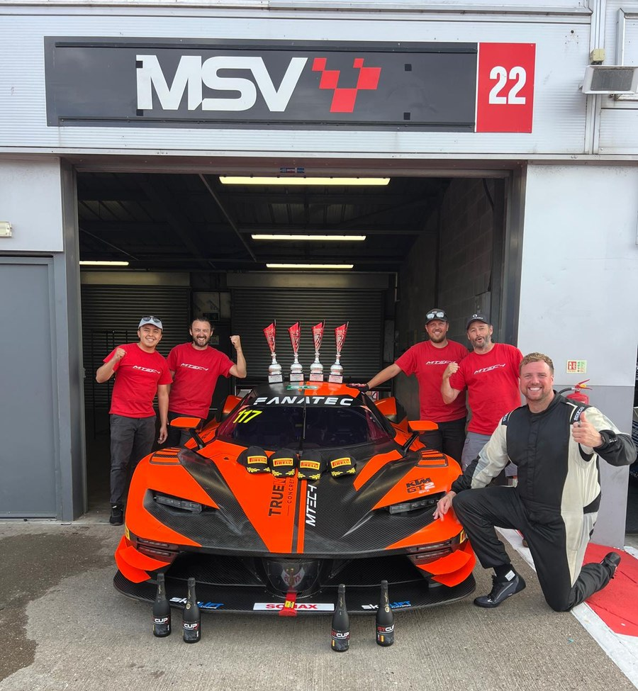

# Wolfgang Guio

**Motorsport engineer — vehicle dynamics, simulation, and model-based control.** Oxford, UK.

---

## About me

I'm a mechanical engineer with a master's in motorsport engineering, specialising in vehicle dynamics, simulations, and model-based control. My work sits at the boundary between physics and computation — building and validating models that translate engineering parameters into measurable lap performance. I've developed MPC controllers for autonomous path-following and ERS thermal management, run full-car lap time simulations under the 2026 regulations in AVL VSM, and modelled multi-body dynamics in MATLAB/Simulink and MSC ADAMS. I also run data acquisition at GT race weekends, where the same models meet a real car, a real driver, and a clock.

  

  <b>GT Cup, July 2026 — Mtech, KTM X-Bow GT2 #117.</b> P4 in Race 1. Race win in Race 2. 
  

---

## Skills

**Engineering & simulation** &nbsp; MATLAB/Simulink · MSC ADAMS · AVL VSM · Vehicle dynamics · MPC & PID control · State-space modelling · OSQP (convex QP) · Lap time simulation · STAR-CCM+ · Siemens NX · Inventor · Femap · CFRP manufacturing processes

**Data & telemetry** &nbsp; Python (Pandas, NumPy, SciPy, Matplotlib, FastF1) · MoTeC M1 ECU · MoTeC i2 · Wintax4 · RaceCon · VBox · Git · XGBoost · scikit-learn · SHAP · BI dashboards · Excel financial modelling · Root cause analysis · KPI reporting · ERP systems

**Languages** &nbsp; Spanish (native) · English (fluent — IELTS C1)

---

## Projects

| Project | Tools | Key Result |
|---|---|---|
| [**MGU-K Thermal-Constrained ERS Optimiser**](https://github.com/wguio07/mguk-thermal-mpc) | Python · OSQP · MPC · FastF1 | T_magnet held at 116.1°C — 23.9°C margin vs 140°C demagnetisation limit over a full Monza lap (84 s, 1,680 MPC solves). Fixed-strategy baseline reached 131.6°C. |
| [**Brake-by-Wire Regen & Brake Bias Optimiser**](https://github.com/wguio07/bbw-regen-optimizer) | Python · Pacejka combined slip · SciPy · FastF1 | Per-corner brake bias optimiser maximising MGU-K regen inside rear-tyre grip limits under 2026 regulations (350 kW, 4 MJ/lap). Peak deceleration validated against 2026 Australian GP qualifying telemetry. |
| [**MPC Driver Model — Autonomous Path Following**](https://github.com/wguio07/MPC-Autonomous-Vehicle-Lateral-Control) | Python · MATLAB · Bicycle model | Lateral MPC validated against ISO standards; structured data pipelines correlating simulation outputs to expected track performance. |
| [**F1 Lap Time Optimisation — 2026 Regulations**](https://github.com/wguio07/F1-2026-Lap-Time-Optimisation) | AVL VSM | Full simulation of a 2026-spec F1 car at Red Bull Ring analysing drag, traction, and energy trade-offs under regulatory constraints. |
| [**Vehicle Dynamics Modelling & Analysis**](https://github.com/wguio07/Vehicle-Dynamics-Modelling-Analysis) | MATLAB/Simulink · MSC ADAMS | Multi-body dynamics and state-space modelling for race car performance; sensitivity analysis for structural performance and ride comfort. |
| [**GT3 DrivAer Fastback — Aerodynamic Optimisation (CFD)**](https://github.com/wguio07/GT3-DrivAer-CFD-Aerodynamic-Optimisation) | STAR-CCM+ · SolidWorks · RANS k-ε | 20% Cl/Cd improvement over baseline; rear wing generating ~200 N downforce in compliance with GT3/LMGT3 regulations. Validated against experimental data within 2.35%. |
| [**F1 Cost Cap Variance Tracker**](https://github.com/wguio07/F1-cost-cap-tracker) | Excel · HTML · FIA Financial Regulations | 28-line-item RAG compliance workbook with auto-calculated variance flags, root cause analysis, and corrective action log. |
| **F1 Tyre Degradation Prediction — ML Pipeline** | Python · XGBoost · scikit-learn · SHAP | Per-lap degradation predicted from ~50K laps of 2023 telemetry using leakage-safe features and time-series cross-validation. Generalisation validated on a held-out 2024 season, behaviour interpreted with SHAP. |

---

## Visuals

| MGU-K Thermal MPC — Heat Loss Dashboard | F1 2026 Lap Time Optimisation — G-G Diagram |
|:---:|:---:|
|  |  |
| **MPC Autonomous Vehicle — Lateral Control** | **Vehicle Dynamics Modelling — Simulink** |
|  |  |
| **GT3 DrivAer Fastback — CFD Aerodynamic Optimisation** | |
|  | |

---

## Experience

**Mtech** — Data Acquisition Junior Engineer, race weekends *(May & Jul 2026)*
GT Cup: data acquisition and telemetry analysis on a KTM X-Bow GT2 (MoTeC M1 ECU, MoTeC i2), feeding car balance and setup direction across the weekend — P4 in Race 1, race win in Race 2. CCRC Home Championship: Ferrari 488 Challenge Evo (Wintax4, RaceCon) and Lamborghini Huracán Super Trofeo Evo1 (MoTeC i2, VBox), turning telemetry into direct driver feedback and supplying tyre temperature and pressure data to guide strategy across stints.

**Owen Mumford** — R&D Test Technician *(Mar 2026 – present, Chipping Norton)*
Prototype validation for medical and drug delivery devices. Mechanical testing to ISO standards and statistical analysis of test results to support design decisions.

**Williams Racing** — Stock Controller *(Feb–Mar 2026, Grove)*
Component fulfilment inside an operating F1 team. Direct exposure to inventory structures, ERP reconciliation, and production flow.

**Oxford Brookes Racing (Autonomous)** — Simulations Engineer *(2024–25)*
Built Unity validation scenarios and analysed telemetry and RMSE metrics to drive performance improvements across cross-functional partner teams.

**Veolia** — Technical Procurement *(2021, Bogotá)*
Managed procurement of heavy machinery and vehicles. Evaluated supplier quotes against engineering specifications and budget constraints, negotiating to reduce procurement costs.

**Coca-Cola FEMSA** — Maintenance Analyst Intern *(2018–19, Bogotá)*
Designed a BI dashboard to report maintenance KPIs. Applied regression analysis to forecast instrument drift and optimise recalibration scheduling, reducing unplanned downtime costs.

---

## Education

**Oxford Brookes University** — MSc Motorsport Engineering, Distinction

**Universidad de los Andes** — BSc Mechanical Engineering · Academic scholarship.

---

## Contact

ukwolfangguio@gmail.com · [LinkedIn](https://www.linkedin.com/in/wolfangguio) · Oxford, UK
